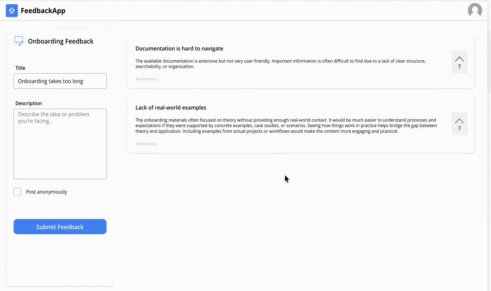
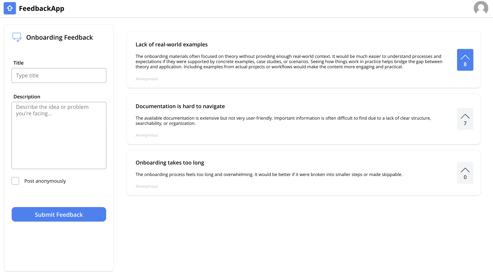
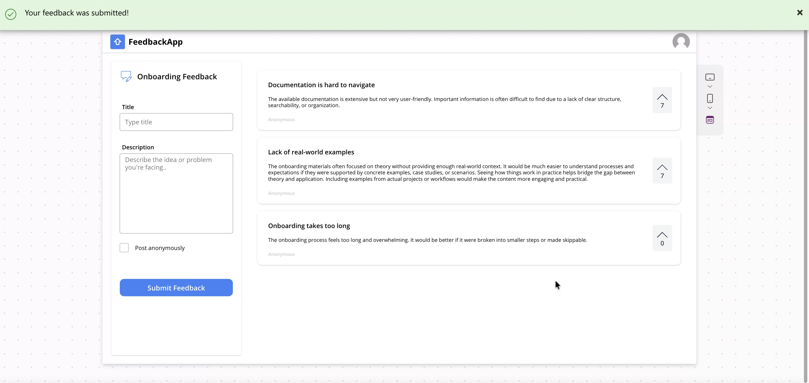

# Employee Onboarding Feedback App

## Overview
This app was designed to help organizations collect, centralize, and prioritize employee feedback during the onboarding process.
It provides a simple way for new hires to report issues, share suggestions, and bring visibility to recurring onboarding challenges.

## Features
- Structured feedback submission form  
- Optional anonymous posting  
- Voting functionality to prioritize the most relevant issues  
- Clean and user-friendly interface for internal adoption  

## Tools & Technologies
- Power Apps (Canvas App)  
- Power Fx  
- SharePoint List

## Demo

## Screenshots

## How It Works
Employees submit onboarding feedback through a simple form by entering a title and description of their issue or suggestion.  
They can choose to post anonymously, which encourages more open and honest feedback. 

Submitted items are displayed in a shared view where other users can review them and vote on the most relevant topics. 

This helps HR or internal teams identify recurring pain points and focus on the areas that have the biggest impact on the onboarding experience.  

## Impact
- Improved visibility into employee onboarding challenges  
- Better prioritization of recurring feedback themes  
- More structured approach to onboarding improvements  
- Enhanced employee experience through continuous feedback collection  
