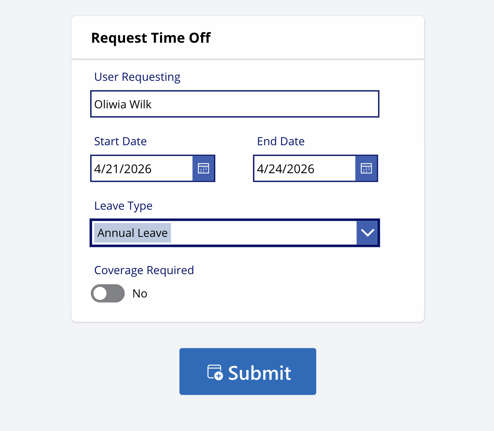
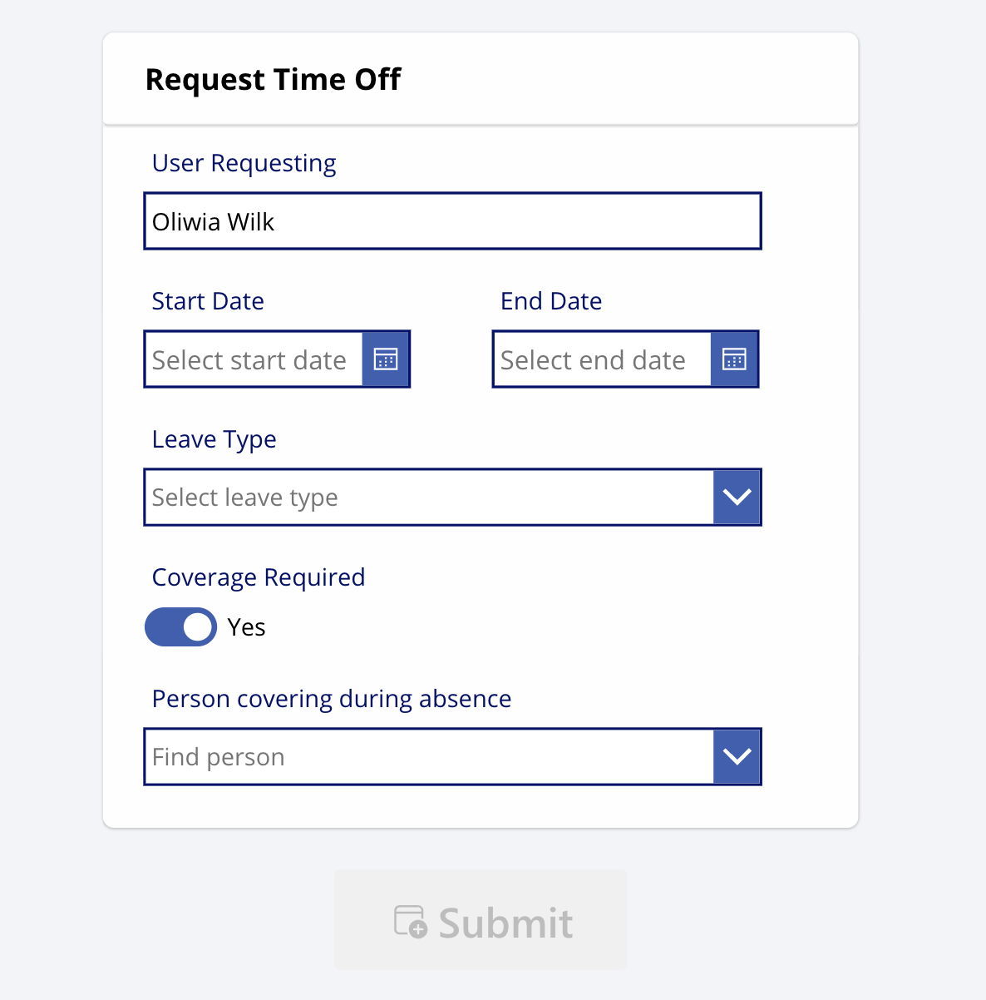
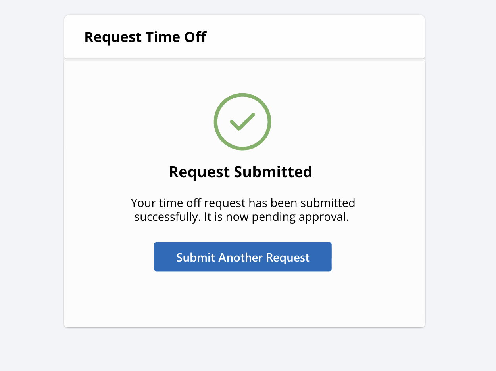
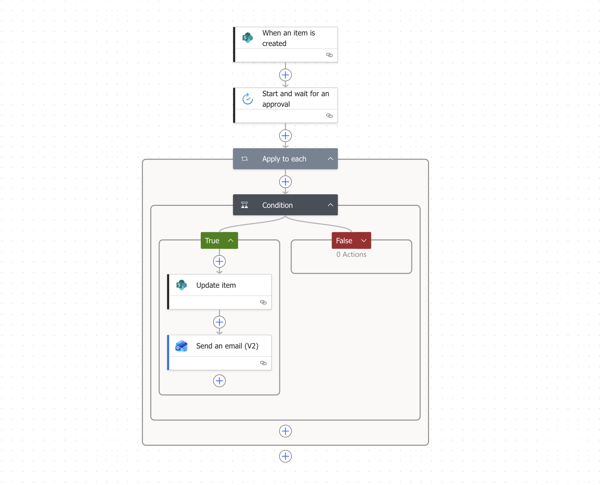
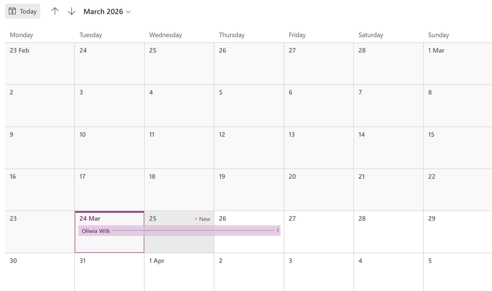

# Request Time Off App + Approval

Power Apps solution for submitting and managing employee leave requests. Built with Power Apps, Power Automate, and SharePoint to support automated approval workflows and structured absence tracking.

## Overview
This app was built to simplify and automate the employee leave request process. It enables employees to submit absence requests through a user-friendly Power Apps interface, while managers review and approve requests using a Power Automate approval workflow.

The solution uses SharePoint as a centralized data source, making absence tracking more structured, transparent, and easier to manage.

## Features
- User-friendly leave request form
- Pre-filled requesting user field
- Leave type selection
- Start date and end date selection
- Date validation to prevent invalid requests
- Coverage required option
- Submission success screen
- Automated manager approval flow
- Centralized request storage in SharePoint

## Tools & Technologies
- Power Apps (Canvas App)
- Power Automate
- SharePoint Online

## Demo

## Screenshots

## How It Works
Employees submit a leave request through the app by selecting the absence type, request dates, and indicating whether coverage is required.

The request is then saved to a SharePoint list and triggers a Power Automate approval workflow.

The manager receives the approval request, reviews the submitted information, and either approves or rejects it. The final decision is recorded in SharePoint, creating a structured and centralized absence request process.

## Impact
- Streamlined leave request submission
- Reduced manual administrative effort
- Improved approval process consistency
- Centralized absence tracking
- Better employee and manager experience
